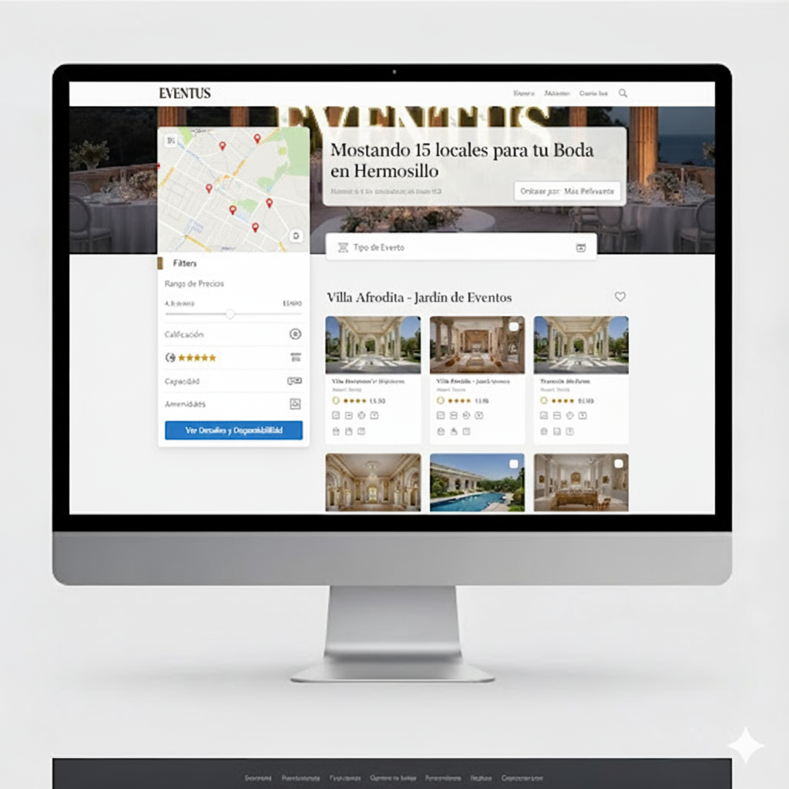

# EVENTUS — Proyecto de Negocio

> **ES:** Plan de negocio y estrategia organizacional para una plataforma digital de reservación de salones de eventos.
> **EN:** Business plan and organizational strategy for a digital event-venue booking platform.

---

## Español

### Descripción

Diseñamos el plan de negocio y la estrategia organizacional de **EVENTUS**, una plataforma digital en
Hermosillo orientada a centralizar y agilizar la reservación de salones de eventos. El trabajo combina
diagnóstico estratégico, diseño de producto, estructura organizacional y finanzas para demostrar que
un sistema informático debe diseñarse pensando en el valor comercial, no solo en el código.

### Integrantes (creadores)

- Ibarra Padilla Sebastián
- Leyva Silva Andrés Jovany
- López Corella David Antonio
- Martínez Ruiz Josué Ignacio

**Materia:** Administración Estratégica · **Maestro:** Ing. Félix Montaño Valle · **Equipo No. 5** · **Universidad de Sonora**

### Marcos y herramientas

- Diagnóstico: FODA, PESTEL, CAME
- Equipo y liderazgo: modelo DISC
- Objetivos: metas SMART

### Contenido

- `images/` — organigrama, diseños de interfaz y material de la presentación.
- `docs/Proyecto-Negocio-AdmEst-25-2.pdf` — reporte completo.

---

## English

### Description

We designed the business plan and organizational strategy for **EVENTUS**, a digital platform in
Hermosillo (Mexico) aimed at centralizing and streamlining event-venue bookings. The work combines
strategic diagnosis, product design, organizational structure, and finance to show that an information
system should be designed around commercial value, not just code.

### Authors (creators)

- Ibarra Padilla Sebastián
- Leyva Silva Andrés Jovany
- López Corella David Antonio
- Martínez Ruiz Josué Ignacio

**Course:** Strategic Management · **Lecturer:** Ing. Félix Montaño Valle · **Team No. 5** · **University of Sonora**

### Frameworks & tools

- Diagnosis: SWOT, PESTEL, CAME
- Team & leadership: DISC model
- Goals: SMART targets

### Contents

- `images/` — org chart, interface designs and presentation material.
- `docs/Proyecto-Negocio-AdmEst-25-2.pdf` — full report.
